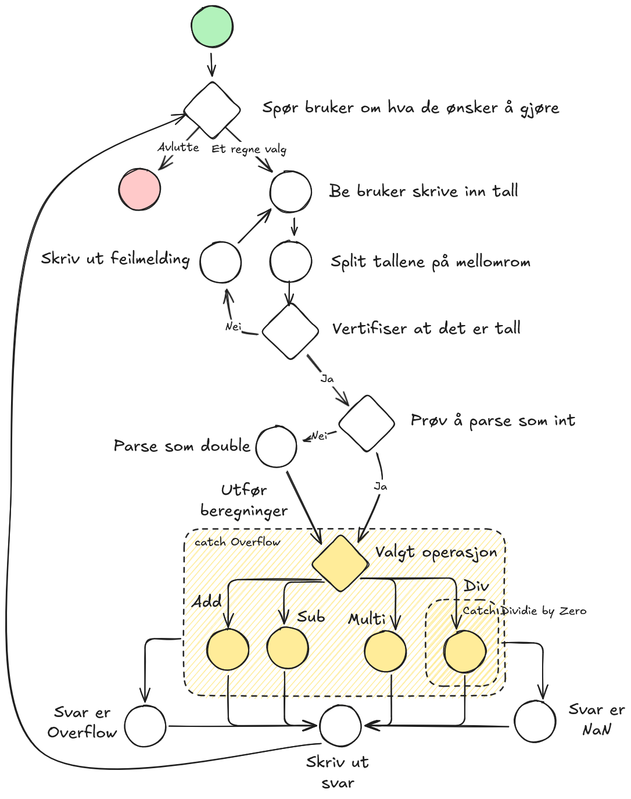

# KH_Calculator

## Kjøring - App
Programmet kjøres fra App katalogen med 'dotnet run'.

## Core
Core inneholder selve kalkulatoren

## Tester
Katalogen Test inneholder et prosjekt med tester for Core.

## Flow

## Arbeidsprosess
1. Create solution and project -> OK
2. Create the tests based on the design -> OK
3. Run tests to make sure they fail -> OK
4. Implement Core until it passes all tests. -> OK
5. Implement a frontend -> OK